# Node | Express

## Baixar e Instalar

- Pesquisar no google por node.js
- Baixar a versão lts que é a versão estável e de longo prazo.

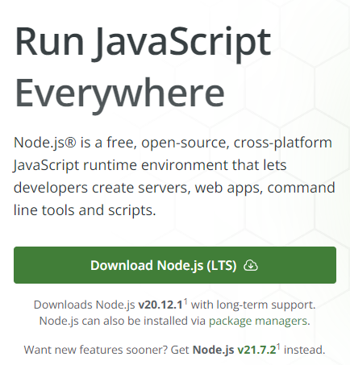

- Instalação no Windows next, next e next...

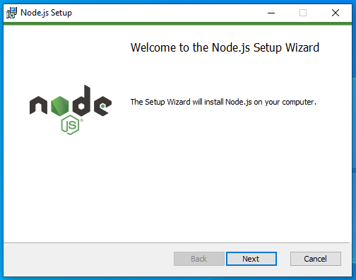

- No terminal ou no cmd digite node -v para verificar se o node foi instalado. Caso não apareceu nada, tente fechar o vscode e tente novamente ou se você estiver no cmd feche ele e tente novamente

```bash
node -v
```

- No terminal mostrará a versão do seu node.js instalado no meu caso é a v16.16.0

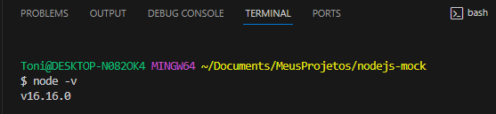

- No Cmd

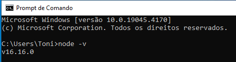

## Após verificar a versão instalada prosseguiremos

- Criaremos nosso arquivo package.json onde estarão nossas dependências de instalação com o seguinte comando no terminal

```bash
npm init -y
```

- Ao rodar o comando acima
  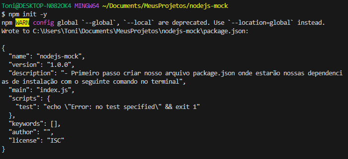

- Então se o comando foi bem sucedido teremos o arquivo package.json criado
  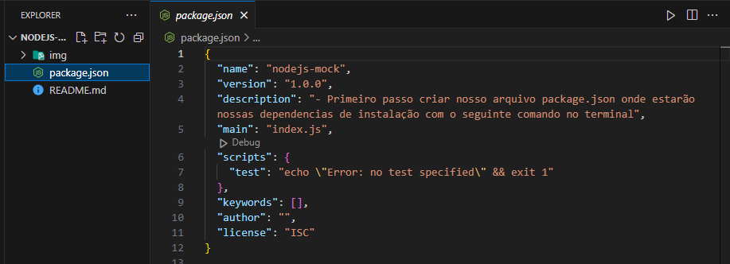

## Pequena alteração no package.json

- Utilizaremos o import e não o require, então precisamos modificar o package.json para essa mudança ser reconhecida, adicionaremos o "type":"module", no nosso arquivo, ficará da seguinte forma:

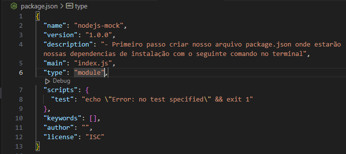

## Instalando nossas dependencias / frameworks para o Node.js

- Uma dica é digitar no google por npm que é um gerenciador de pacotes do javascript

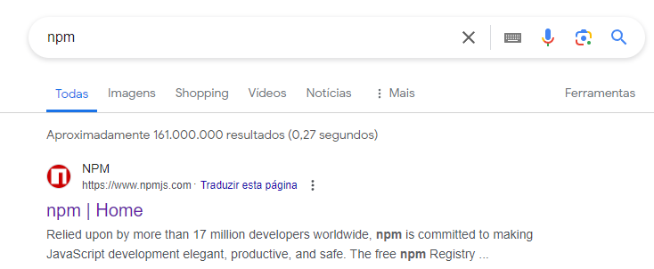

- No site do npm podemos ver como instalar os pacotes, instalaremos o express

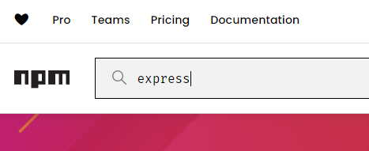

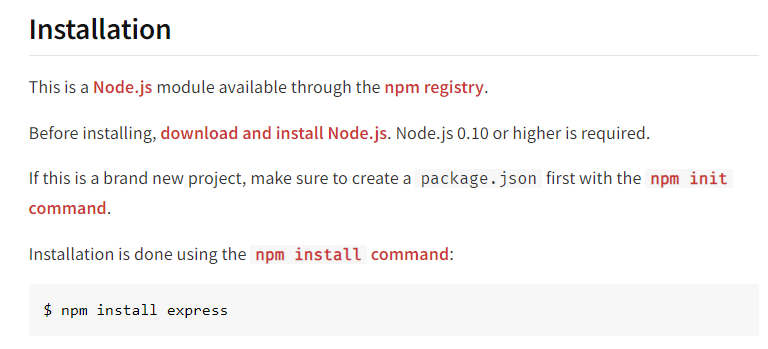

- Para instalar o express, digitaremos no nosso terminal npm install express ou npm i express

```bash
npm install express
```

```bash
npm i express
```

- Em caso de sucesso veja na imagem abaixo:

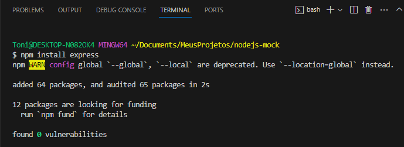

- No arquivo package.json onde ficará nossas instalações de dependências e frameworks, houve uma alteração indicando que o express foi instalado e sua versão

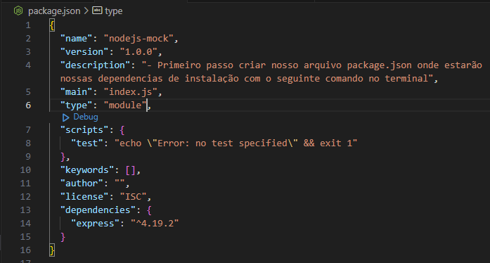

```bash
"dependencies": {
    "express": "^4.19.2"
  }
```

- Ao instalar o express, também foi criado a pasta node_modules na qual contem o express e dependências para ele funcionar, aproveitando vamos criar um arquivo chamado .gitignore, no qual ao subirmos o projeto para o github ele não vai enviar a pasta node_modules e dentro dele escreveremos o nome da pasta

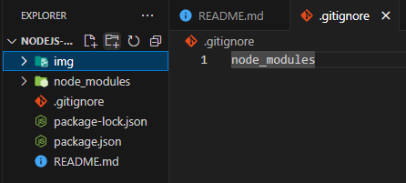

- Para indicar que esse repositório é um repositório git digitaremos git init no terminal

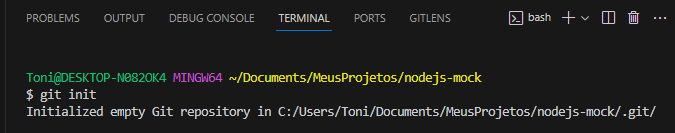

- Agora a pasta node_modules ficou cinza indicando que ela não será enviada

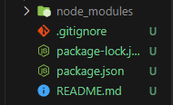

## Criando arquivo app.js

- No site do npm ele nos indica um exemplo para criar uma rota GET

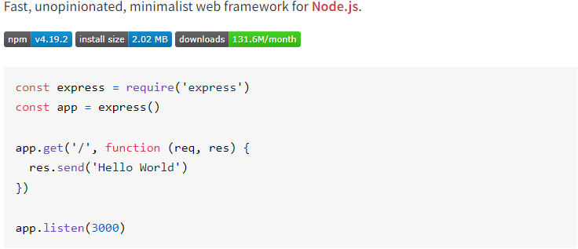

- Como estamos utilizando o import mudaremos um pouco essa estrutura mas o resultado será o mesmo uma respota da API com um Hello World
- Utilizaremos o import, depois vamos atribuir a const app o express iniciado, através do app vamos chamar as opções que o express fornece nesse caso o metódo GET na rota/endpoint raiz / e que terá a resposta Hello World, por fim o servidor será escutado na porta 3000 exibindo uma mensagem que o servidor está rodando

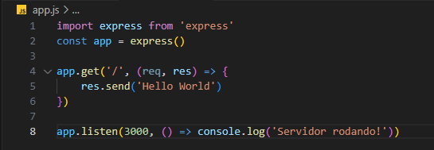

- Servidor rodando!

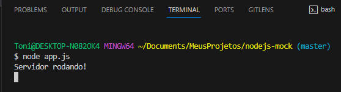

- Usaremos uma nova ferramenta na qual testaremos futuramente nossas rotas/endpoints o postman

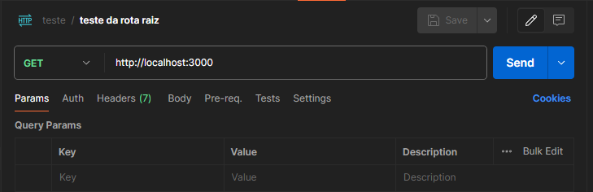

- Acima fizemos a requisição (req) com o método GET na rota/endpoint raiz e a resposta (res) foi Hello World

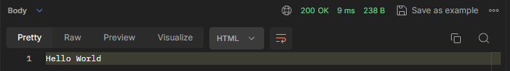

